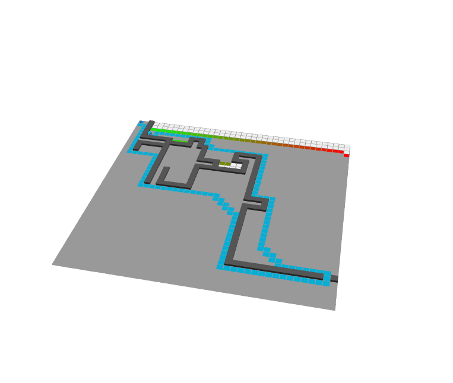

# astar-threejs
A* algorithm visualizer and solver

## Disclamer
This code was made in a few hours with the single purpose of showcasing a class presentation.
Feel free to modify and base further work on this but keep in mind that the code quality might be sub-optimal.

## How to use it
Simply launch the index page on a web browser and you are ready to go.

Press 1 to enter on "Play mode" (press r to restart the simulation)
Press 2 to enter on "Construction mode"
Press 3 to enter on "Update from position mode"
Press 4 to enter on "Update to position mode"

